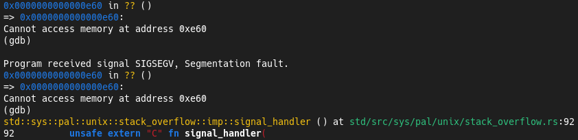
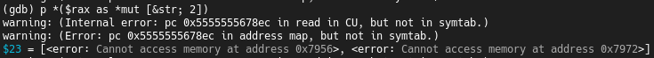
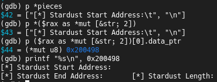
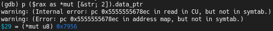
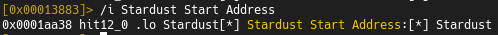
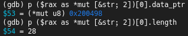
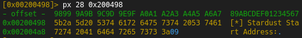

# Unstable/Incomplete Rust PIC Template

This is a PoC targeted at x64 linux and has numerous issues, it is based on the following previous work:
- https://bruteratel.com/research/feature-update/2021/01/30/OBJEXEC/
- https://5pider.net/blog/2024/01/27/modern-shellcode-implant-design/
- https://github.com/wumb0/rust_bof
- https://kerkour.com/rust-position-independent-shellcode

Following is the current output of `cargo make run`.

```
[+] Hello Stardust
[1]    104538 segmentation fault (core dumped)  ./target/x86_64-unknown-linux-gnu/debug/runner
```

Following is the desired output and current output of `cargo make run-nopic`

```
[+] Hello Stardust
[*] Stardust Start Address:     0x10050
[*] Stardust End Address:       0x15278
[*] Stardust Length:            21032B
[*] Stardust Data Offset:       0x16000
```

## Problem #1 - core::fmt Segmentation Fault


### Diagnosis

Using `alloc` appears to work but functionality that requires `compilier_builtins`, e.g. the following functions:
- `memcpy`
- `memmove`
- `memset`
- `memcmp`
- `bcmp`

Will result in a seg fault, an example of this is the `format!` macro. This seg fault appears to be the result of a failed `test rdx, rdx` within `core::fmt::write::hbd7fc918960f6ce7` resulting in a call to the `_gcc_except_table` which has been removed by [linker.ld](./stardust/linker.ld).

Offending dissassembly in `radare2` see `0x00001525` for seg fault:


Seg fault as observed in `GDB`:



If you debug the elf without the linker script you can see that this is a result of a failed check within `if !piece.is_empty()`:


This check is within the following code
@ [https://github.com/rust-lang/rust/blob/master/library/core/src/fmt/mod.rs](https://github.com/rust-lang/rust/blob/150247c338a54cb3d08614d8530d1bb491fa90db/library/core/src/fmt/mod.rs#L1172C1-L1190C10):

```rust
/* core::fmt::write () at core/src/fmt/mod.rs:1179 */
/* 1172 */ match args.fmt {
/* 1173 */     None => {
/* 1174 */         // We can use default formatting parameters for all arguments.
/* 1175 */         for (i, arg) in args.args.iter().enumerate() {
/* 1176 */             // SAFETY: args.args and args.pieces come from the same Arguments,
/* 1177 */             // which guarantees the indexes are always within bounds.
/* 1178 */             let piece = unsafe { args.pieces.get_unchecked(i) };
/* 1179 */             if !piece.is_empty() { // This is the check currently failing
/* 1180 */                 formatter.buf.write_str(*piece)?;
/* 1181 */             }
/* 1182 */
/* 1183 */             // SAFETY: There are no formatting parameters and hence no
/* 1184 */             // count arguments.
/* 1185 */             unsafe {
/* 1186 */                 arg.fmt(&mut formatter)?;
/* 1187 */             }
/* 1188 */             idx += 1;
/* 1189 */         }
/* 1190 */     }
```

According to strace the `mmap` made to allocate the string `PIC`/`NOPIC` is identical:

`PIC`

---

```
write(1, "[+] Hello Stardust\n", 19[+] Hello Stardust
)    = 19
mmap(NULL, 58, PROT_READ|PROT_WRITE, MAP_PRIVATE|MAP_ANONYMOUS, -1, 0) = 0x7fcc8060f000
--- SIGSEGV {si_signo=SIGSEGV, si_code=SEGV_MAPERR, si_addr=0xe30} ---
```

`NOPIC`

---

```
write(1, "[+] Hello Stardust\n", 19[+] Hello Stardust
)    = 19
mmap(NULL, 58, PROT_READ|PROT_WRITE, MAP_PRIVATE|MAP_ANONYMOUS, -1, 0) = 0x7f199cd9e000
write(1, "[*] Stardust Start Address:\t0x21"..., 37[*] Stardust Start Address:  0x21e7e0
) = 37
```

Following the hypothesis that this is a result of a failing `if !piece.is_empty()` the difference between `PIC`/`NOPIC` is apparent:

`PIC`

---



`NOPIC`

---




Furthering my hypothesis with `radare2`:

`PIC`

---





> Observe these addresses are different

`NOPIC`

---





> While these addresses are identical.


### Issue

The compiler is using absolute addresses to reference the `pieces` in `Arguments { pieces, fmt: None, args }` passed to `alloc::fmt::format::h6658b5a814ad0151` due to the use of the `alloc::format!` macro:

The two absolute address the `PIC` is trying to access are:
- `0x7956`
- `0x7972`

```
[0x00000780]>  px 28 @ 0x7956
- offset -  5657 5859 5A5B 5C5D 5E5F 6061 6263 6465  6789ABCDEF012345
0x00007956  5b2a 5d20 5374 6172 6475 7374 2053 7461  [*] Stardust Sta
0x00007966  7274 2041 6464 7265 7373 3a09            rt Address:.
```

```
[0x00000780]>  px 26 @ 0x7972
- offset -  7273 7475 7677 7879 7A7B 7C7D 7E7F 8081  23456789ABCDEF01
0x00007972  0a5b 2a5d 2053 7461 7264 7573 7420 456e  .[*] Stardust En
0x00007982  6420 4164 6472 6573 733a                 d Address:
```

Because these values have been extracted from the `.text` section to become shellcode these `*mut &str` pointers are invalid.
